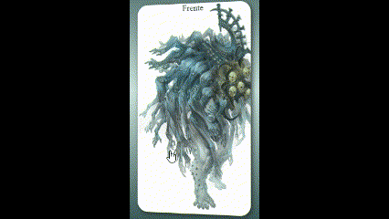

## Aplendendo a fazer o efeito de flip com CSS

> A propriedade `perspective` indica a profundidade do container, ou o quao longe o objeto está do usuario

> A propriedade `backface-visibility` ocultara o verso do casrtao

> A propriedade `trasform-style` especifica como os elementos aninhados são resnderizados no espaço 3D

~~~html
    

        

        

    

~~~

### Cria o container e o card para o efeito
~~~css
    .container{
         height: 400px;
        width: 220px;
        perspective: 1000px;    
        background-color: transparent;
    }

    .front, .back{
        position: absolute;
        backface-visibility: hidden;
        transform-style: preserve-3d;
        transition: all 1s ease;
        width: 100%;
        height: 100%;
    }
~~~

### Adiciona o movimento com o passar do mouse ou com o clicar

~~~css
    .container:hover .front{
    transform: rotatey(-180deg);
    }

    .container:hover .back{
        transform: rotatey(0deg);
    }

    .container2:active .front{
        transform: rotatey(-180deg);
    }

    .container2:active .back{
        transform: rotatey(0deg);
    }
~~~
